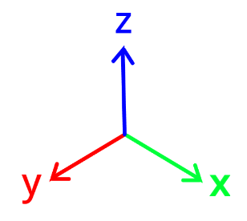

# Chroniques de Voxellia 2

## Axes du monde

.

## Les propriétés

Les propriétés servent à modifier la manière dont le monde intéragit avec l'objet.

### Les classes

- Property : Propriété simple définie par son nom
- PropertyLight : Propriété qui ajoute une lumière qui émane l'objet. NAME = light
- PropertySound : Propriété qui ajoute un son à l'objet. NAME = sound

### Les propriétés existantes

- light : Ajoute une lumière qui émane l'objet.
- sound : Ajoute un son à l'objet.
- noCollision : Désactive les collisions de l'objet.
- noCollisionEntity : Désactive les collisions de l'entité avec les autres entités.
- noCollisionBlock : Désactive les collisions de l'entité avec les blocs.
- noCollisionSame : Désactive les collisions avec les objets de même type.

## Les états

Les états sont des couples clés/valeurs.
La clé est une chaine de caractère représentant le nom de l'état et la valeur peut être de n'importe quel type.

Ils peuvent servir pour paramétrer certains comportements des objets depuis le chargement du monde.

Si la valeur est redéfinie depuis le chargement du monde, seul ces types de données sont supportés :

- String (etat=text)
- double (etat=-1.3)
- int (etat=54)
- boolean (etat=true)
- String[] (etat={text_long,text2})
- double[] (etat={1.36,4.6,-78.0})
- int[] (etat={-7,2})
- boolean[] (etat={true,false})

Si le nom de l'état correspond au nom d'une propriété et que sa valeur est le boolean false, alors la propriété de même nom est ignorée.

## Les Commportements

Les comportements permmetent de changer la manière dont les objets réagissent à certains évenements.

Voici une liste des comportements et de leurs états configurables.

### Comportements des blocs

- ActivableProperty : Désactive une propriété lorsque le bloc est désactivé.
    - activated : boolean si le bloc est activé ou non (false par défaut)
    - network : int le réseau sur lequel le bloc doit être activé (0 par défaut)

- ApplyForce : Applique une force sur les entités en collision avec le bloc
    - force : double[3] la force appliquée aux l'entités (définit dans le constructeur par défaut)

- ChangeWorld : Charge un autre monde lorsque le joueur passe dessus.
    - world : String le nom du monde à charger (vide par défaut)
    - spawnpoint : int le numéro du point d'apparition du joueur (-1 si aléatoire) (-1 par défaut)

- Kill : Tue les entités qui touche le bloc.

- Lever : Active et désactive les objets du même réseau lorsqu'une entité intéragit avec.
    - activated : boolean si le bloc est activé ou non (false par défaut)
    - network : int le réseau sur lequel le bloc s'active (0 par défaut)

- Liquid : Permet l'écoulement du bloc dans le monde.
    - 2 paramètres lors de l'ajout du comportement :
        - maxLiquid : int la quantité maximum de liquide dans le bloc
        - viscosity : int nombre de tick entre chaque écoulement
    - liquid : int la quantité de liquide dans le bloc (max par défaut)
    - liquidNext : int la quantité de liquide qui sera ajouté après la mise à jour (0 par défaut) (déconseillé de configurer)

- NewWorld : Charge un nouveau monde lorsque le joueur passe dessus et décharge les précédents.
    - world : String le nom du monde à charger (vide par défaut)
    - spawnpoint : int le numéro du point d'apparition du joueur (-1 si aléatoire) (-1 par défaut)

- PressurePlate : Active les objets du même réseau lorsqu'une entité se trouve dessus.
    - activated : boolean si le bloc est activé ou non (false par défaut)
    - network : int le réseau sur lequel le bloc s'active (0 par défaut)

- Text : Permet d'afficher un texte lorsqu'une entité interagit avec le bloc.
    - text : String le texte affiché (null par défaut)
    - texts : String[] la chaine de textes (String[0] par défaut)

### Comportements des entités

- ActivableProperty : Désactive une propriété lorsque l'entité est désactivée.
    - activated : boolean si l'entité est activée ou non (false par défaut)
    - network : int le réseau sur lequel l'entité doit être activée (0 par défaut)

- ActivableMoving : Va à un endroit quand elle est activée et un autre lorsqu'elle est désactivée.
    - activated : boolean si l'entité est activée ou non (false par défaut)
    - network : int le réseau sur lequel l'entité doit être activée (0 par défaut)
    - speed : double la vitesse de déplacement de l'entité (0.1 par défaut)
    - position1 : double[3] la position vers laquelle va l'entité désactivée (position de départ par défaut)
    - position2 : double[3] la position vers laquelle va l'entité activée (position de départ par défaut)

- ApplyForce : Applique une force sur l'entité
    - force : double[3] la force appliquée à l'entité ({0,0,-0.3} par défaut)

- Kill : Tue les entités qui touche l'entité.

- Mortal : Détruit l'entité lors de sa mort.

- Player : Les comportements spécifiques au joueur.

- Pushable : Permet à l'entité d'être poussé par d'autres entités.

- Text : Permet d'afficher un texte lorsqu'une entité interagit avec l'entité.
    - text : String le texte affiché (null par défaut)
    - texts : String[] la chaine de textes (String[0] par défaut)
